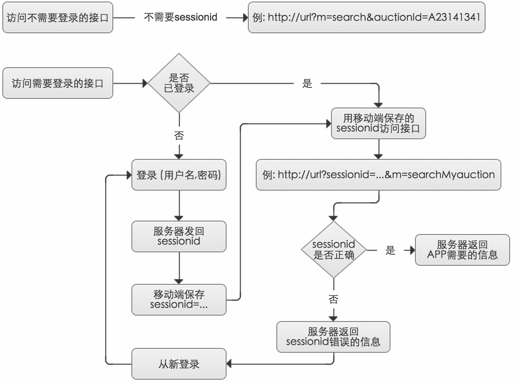
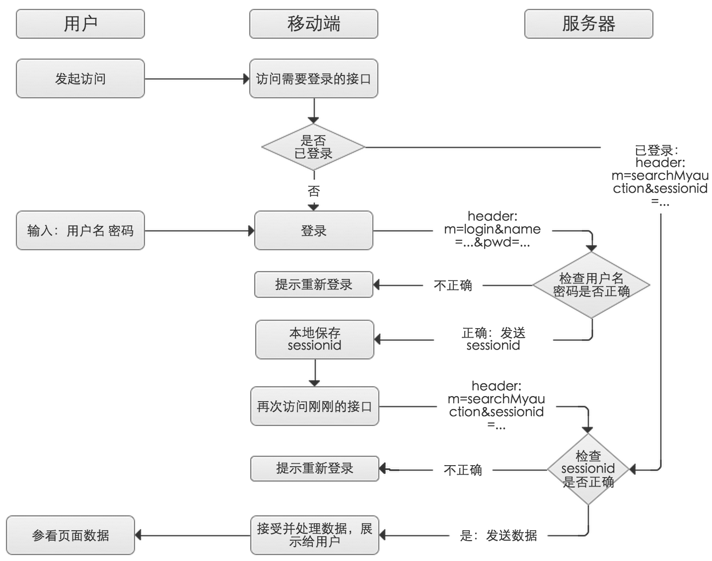

# 博古斋移动接口开发文档

**注：[接口开发进度](接口开发进度.md)**   
**注：[软件优化进度](软件优化进度.md)**  


### 一、接口规范

规范一：所有接口使用Markdown文档维护，Github更新
 
规范二：Http Request 为了安全考虑采用POST方式，UTF-8编码，key=value形式参数, 图片和文件通过HTTP multipart/form-data请求协议上传
 
规范三：Http Response 返回 json 数据格式信息，UTF-8编码，json数据中的数字尽量用字符串代替，如"20","20150109","30.00"等
 
规范四：当需要从服务器获取图片、文档等文件时，提供URL，采用GET方式获取文件
 
规范五：

- 登录后服务器返回一个sessionid
- 访问需要登录的接口须带有sessionid字，访问不需要登录的接口则不用带上sessionid字段。 
- 当sessionid不正确或者失效时，需要重新登录，重新获取sessionid
- 当用户登出后，sessionid失效，该逻辑需要服务器实现

 
规范六：所有APP接口采用统一url，不同的接口间以参数m区分，例如：  

- http://url?m=login&phone=13812345678&password=123456
- http://url?m=resetpwd&sessionid=...&oldpwd=...&newpwd=...
- http://url?m=search&auctionid=MT0112

### 二、接口字段规范  

```
拍卖会状态(auctionMain status)  "预展中" "拍卖中" "已结束"
拍卖会拍卖类型(auctionMain type) "同步" "网络"

同步专场状态(auctionSession status)  "未开拍" "已开拍" "已结束"
网络专场状态(auctionSession status)  "未开拍" "已开拍" "已结束"

专场拍卖类型(auctionSession type)  "中国书画" 之类

拍品状态(deal type)  "成交" "已上拍" "未上拍" "流拍" "撤拍" 
拍品成交方式(bid type)  "网络" "现场" 

性别(sex)               1:男  0:女  -1:未知
出价规则(bid rule)       1:二五八规则 2:固定加价 3:最小加价 4:不限

```  

### 三、接口模板

Http Requset :  

``` 
m=login
mobile=13812345678
password=123456 
```
Http Response : 

- code=0 : 登录成功，返回用户信息和seesionid
- code=1 : 登录失败，无此用户名
- code=2 : 登录失败，密码错误

几种情况的返回json数据如下

``` 
{ 
    "code": 0;
    "data": {
    	"sessionid": "1h283019400031n22hhu22313145252";
    	"account":{
			...   
		}     
	}
}
```
``` 
{ 
    "code": 1;
}
```
``` 
{ 
    "code": 2;
}
```


--- 

###附一：移动端sessionid逻辑图

</img> 

###附二：sessionid时序图

</img> 
